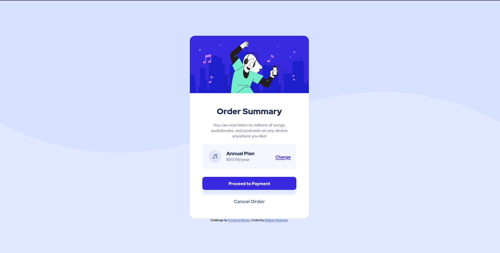
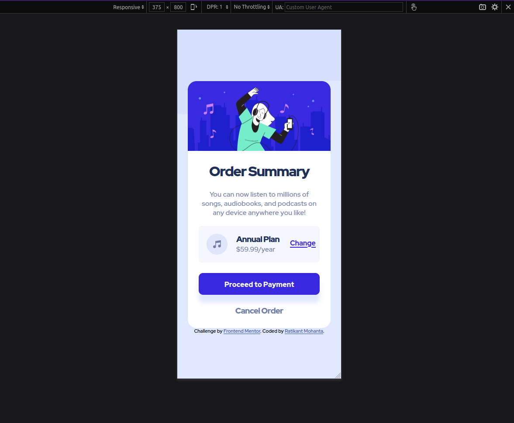

# Frontend Mentor - Order summary card solution


This is a solution to the [Order summary card challenge on Frontend Mentor](https://www.frontendmentor.io/challenges/order-summary-component-QlPmajDUj). Frontend Mentor challenges help you improve your coding skills by building realistic projects.

## Table of contents

- [Overview](#overview)
  - [The challenge](#the-challenge)
  - [Screenshot](#screenshot)
  - [Links](#links)
- [My process](#my-process)
  - [Built with](#built-with)
  - [What I learned](#what-i-learned)
  - [Continued development](#continued-development)
  - [Useful resources](#useful-resources)
- [Author](#author)
- [Acknowledgments](#acknowledgments)

## Overview

### The challenge

Users should be able to:

- See hover states for interactive elements

### Screenshot





### Links

- Solution URL: [https://github.com/ratikantmohanta/order-summary-component-main](https://github.com/ratikantmohanta/order-summary-component-main)
- Live Site URL: [https://ratikantmohanta.github.io/order-summary-component-main/](https://ratikantmohanta.github.io/order-summary-component-main/)

## My process

### Built with

- Semantic HTML5 markup
- CSS custom properties

**Note: These are just examples. Delete this note and replace the list above with your own choices**

### What I learned

To see how you can add code snippets, see below:

```html
<h1>Some HTML code I'm proud of</h1>
```

```css
.proud-of-this-css {
  color: papayawhip;
}
```

```js
const proudOfThisFunc = () => {
  console.log('🎉')
}
```

**Note: Delete this note and the content within this section and replace with your own learnings.**

### Continued development

-Need to improve my documentation.
-Code Optimization.

### Useful resources

- [1 - fonts.google.com](https://fonts.google.com) - Selecting desired Fonts.

## Author

- Website - [Ratikant Mohanta](https://www.your-site.com)
- Frontend Mentor - [@ratikantmohanta](https://www.frontendmentor.io/profile/ratikantmohanta)
- GitHub - [@ratikantmohanta](https://github.com/ratikantmohanta)

## Acknowledgments

Was recomended to frontendmentor.io by
Dr. Angela Yu(<https://www.udemy.com/user/4b4368a3-b5c8-4529-aa65-2056ec31f37e/>)